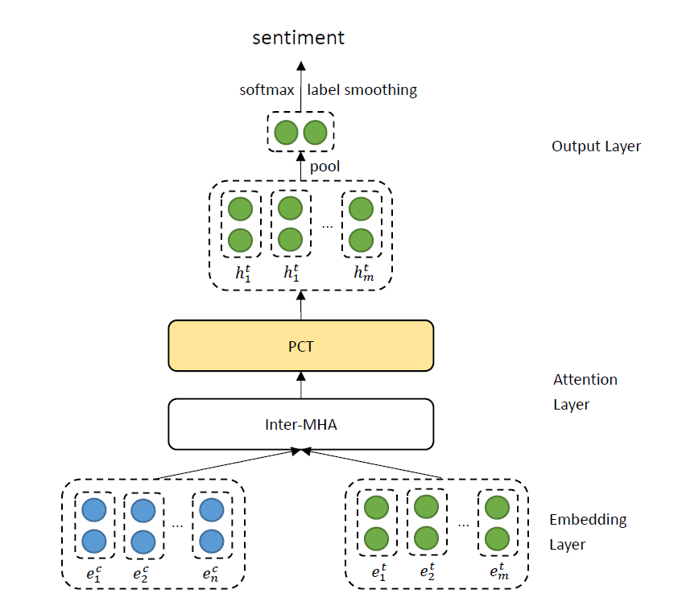

# Experiments
## Laptop
##### AEN_BERT
aen_bert-laptop-191112-1606.log
```shell script
> val_acc: 0.7774, val_f1: 0.7305
>> test_acc: 0.7774, test_f1: 0.7244
```
##### AEN_ROBERTA
aen_roberta-laptop-191119-1942.log
```shell script
> val_acc: 0.7665, val_f1: 0.7429
>> test_acc: 0.7931, test_f1: 0.7596
```
##### AEN_BERT, replaced with max pooling
aen_bert-laptop-191120-2108.log
```shell script
> val_acc: 0.7602, val_f1: 0.7256
>> test_acc: 0.7712, test_f1: 0.7223
```
##### AEN_BERT_SIMPLE (removed 2/3 parts)
aen_bert_simple-laptop-191124-1807.log
```shell script
> val_acc: 0.7367, val_f1: 0.7005
>> test_acc: 0.7539, test_f1: 0.6860
```

##### AEN_BERT_SIMPLE, ignoring target
aen_bert_simple-laptop-191124-2029.log
```shell script
> val_acc: 0.7696, val_f1: 0.7165
>> test_acc: 0.7774, test_f1: 0.7318
```
##### AEN_BERT_SIMPLE, n_head=16
aen_bert_simple-laptop-191127-1147.log
```shell script
> val_acc: 0.7476, val_f1: 0.7037
>> test_acc: 0.7837, test_f1: 0.7421
```
##### AEN_BERT_SIMPLE, n_head=24
aen_bert_simple-laptop-191127-1208.log
```shell script
> val_acc: 0.7571, val_f1: 0.7037
>> test_acc: 0.7696, test_f1: 0.7221
```
##### AEN_BERT_SIMPLE, n_head=4
aen_bert_simple-laptop-191127-1028.log
```shell script
> val_acc: 0.7116, val_f1: 0.6707
>> test_acc: 0.7774, test_f1: 0.7278
```
##### AEN_BERT_SIMPLE, n_head=2
aen_bert_simple-laptop-191127-1040.log
```shell script
> val_acc: 0.7727, val_f1: 0.7164
>> test_acc: 0.7884, test_f1: 0.7480
```
##### AEN_BERT_SIMPLE, n_head=1
aen_bert_simple-laptop-191127-1054.log
```shell script
> val_acc: 0.7900, val_f1: 0.7423
>> test_acc: 0.7900, test_f1: 0.7423
```
##### AEN_BERT_SIMPLE, replaced pooling with LSTM(,600)
aen_bert_simple-laptop-191128-1521.log
```shell script
> val_acc: 0.7367, val_f1: 0.6475
>> test_acc: 0.7602, test_f1: 0.6910
```
##### AEN_BERT_SIMPLE, with CDM
aen_bert_simple-laptop-191201-1816.log
```shell script
> val_acc: 0.7712, val_f1: 0.7319
>> test_acc: 0.7884, test_f1: 0.7591
```
##### AEN_BERT_SIMPLE, with CDW
aen_bert_simple-laptop-191201-1830.log
```shell script
> val_acc: 0.7712, val_f1: 0.7169
>> test_acc: 0.7774, test_f1: 0.7327
```
##### AEN_SIMPLE
aen_simple-laptop-191202-1844.log
```shell script
> val_acc: 0.7414, val_f1: 0.6620
>> test_acc: 0.7790, test_f1: 0.7462
```
##### AEN_SIMPLE, n_head=1
aen_simple-laptop-191202-1859.log
```shell script
> val_acc: 0.7633, val_f1: 0.7201
>> test_acc: 0.7837, test_f1: 0.7446
```
##### AEN_SIMPLE, n_head=2
aen_simple-laptop-191202-1915.log
```shell script
> val_acc: 0.7367, val_f1: 0.6778
>> test_acc: 0.7868, test_f1: 0.7524
```
##### AEN_SIMPLE, n_head=4
aen_simple-laptop-191202-1936.log
```shell script
> val_acc: 0.7524, val_f1: 0.6912
>> test_acc: 0.7853, test_f1: 0.7460
```
##### AEN_SIMPLE, n_head=16
aen_simple-laptop-191202-1949.log
```shell script
> val_acc: 0.7696, val_f1: 0.7245
>> test_acc: 0.7931, test_f1: 0.7412
```
##### AEN_SIMPLE, n_head=24
aen_simple-laptop-191202-2008.log
```shell script
> val_acc: 0.7492, val_f1: 0.7165
>> test_acc: 0.7821, test_f1: 0.7420
```
#### AEN_SIMPLE, lstm_hid=300
aen_simple-laptop-191202-2027.log
```shell script
> val_acc: 0.7555, val_f1: 0.7108
>> test_acc: 0.7915, test_f1: 0.7491
```
##### AEN_SIMPLE, lstm_hid=900
aen_simple-laptop-191202-2042.log
```shell script
> val_acc: 0.7445, val_f1: 0.6857
>> test_acc: 0.7884, test_f1: 0.7488
```
##### AEN_SIMPLE, lstm_layer=2
aen_simple-laptop-191202-2059.log
```shell script
> val_acc: 0.7712, val_f1: 0.7347
>> test_acc: 0.7712, test_f1: 0.7347
```
##### AEN_SIMPLE, lstm_layer=3
aen_simple-laptop-191202-2111.log
```shell script
> val_acc: 0.6724, val_f1: 0.6061
>> test_acc: 0.6959, test_f1: 0.5600
```
##### AEN_SIMPLE, lstm_hid=300, n_head=16
aen_simple-laptop-191203-0938.log
```shell script
> val_acc: 0.7618, val_f1: 0.7195
>> test_acc: 0.7806, test_f1: 0.7483
```
##### AEN_SIMPLE, lstm_hid=300, lstm_layer=2
aen_simple-laptop-191203-0952.log
```shell script
> val_acc: 0.7398, val_f1: 0.6612
>> test_acc: 0.7696, test_f1: 0.7250
```
##### AEN_SIMPLE, lstm_hid=300, lstm_layer=3
aen_simple-laptop-191203-1006.log
```shell script
> val_acc: 0.6082, val_f1: 0.4498
>> test_acc: 0.7038, test_f1: 0.5968
```
##### AEN_SIMPLE, lstm_hid=300, lstm_layer=1, n_head=1
aen_simple-laptop-191203-1017.log
```shell script
> val_acc: 0.7618, val_f1: 0.7291
>> test_acc: 0.7931, test_f1: 0.7609
```
##### AEN_SIMPLE, lstm_hid=300, lstm_layer=1, n_head=2
aen_simple-laptop-191203-1028.log
```shell script
> val_acc: 0.7633, val_f1: 0.7136
>> test_acc: 0.7837, test_f1: 0.7371
```
##### AEN_SIMPLE, lstm_hid=300, lstm_layer=1, n_head=4
aen_simple-laptop-191203-1040.log
```shell script
> val_acc: 0.7680, val_f1: 0.7188
>> test_acc: 0.7821, test_f1: 0.7487
```
##### AEN_SIMPLE, lstm_hid=300, lstm_layer=1, n_head=16
aen_simple-laptop-191203-1051.log
```shell script
> val_acc: 0.7524, val_f1: 0.6793
>> test_acc: 0.7790, test_f1: 0.7388
```
##### AEN_SIMPLE, lstm_hid=300, lstm_layer=1, n_head=24
aen_simple-laptop-191203-1103.log
```shell script
> val_acc: 0.7335, val_f1: 0.6973
>> test_acc: 0.7759, test_f1: 0.7306
``` 
##### AEN_SIMPLE, roberta, lstm_hid=300, lstm_layer=1, n_head=1
aen_simple-laptop-191203-1116.log
```shell script
> val_acc: 0.7696, val_f1: 0.7191
>> test_acc: 0.7868, test_f1: 0.7409
```
## Twitter
##### AEN_BERT_SIMPLE (removed 2/3 parts)
aen_bert_simple-twitter-191124-1823.log
```shell script
> val_acc: 0.6676, val_f1: 0.6571
>> test_acc: 0.7254, test_f1: 0.7100
```
##### AEN_BERT_SIMPLE, ignoring target
aen_bert_simple-twitter-191124-2045.log
```shell script
> val_acc: 0.6344, val_f1: 0.6328
>> test_acc: 0.7283, test_f1: 0.7187
```
##Restaurant
##### AEN_BERT_SIMPLE (removed 2/3 parts)
aen_bert_simple-restaurant-191124-1849.log
```shell script
> val_acc: 0.7920, val_f1: 0.6477
>> test_acc: 0.8045, test_f1: 0.6770
```
##### AEN_BERT_SIMPLE, ignoring target
aen_bert_simple-restaurant-191124-2115.log
```shell script
> val_acc: 0.7857, val_f1: 0.6735
>> test_acc: 0.8107, test_f1: 0.6894
```